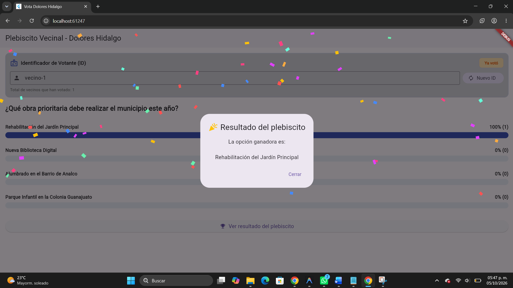

# 🗳️ Vota Dolores Hidalgo — Plebiscito Vecinal con TDD

> **Desarrollo Móvil Integral** — Proyecto complementario de práctica TDD (Test-Driven Development).  
> Un plebiscito vecinal digital con barras de resultados animadas y revelación del ganador con confeti, construido 100% con TDD en Flutter y Dart puro en su capa de negocio.

---

## 📋 Descripción del Proyecto

El municipio de **Dolores Hidalgo** propone una consulta ciudadana:  
*«¿Qué obra prioritaria debe realizar el municipio este año?»* con varias opciones de infraestructura vecinal:
- 🌳 Rehabilitación del Jardín Principal
- 📚 Nueva Biblioteca Digital
- 💡 Alumbrado en el Barrio de Analco
- 🛝 Parque Infantil en la Colonia Guanajuato

Los vecinos eligen su opción favorita, los resultados se calculan y visualizan con barras animadas fluidas (`TweenAnimationBuilder`), y al concluir la consulta se revela al ganador con una animación elástica (`Curves.elasticOut`) y lluvia de confeti mediante `CustomPainter`.

---

## 🛡️ Reglas de Negocio Protegidas con Pruebas

1. **Voto único**: Cada persona (identificada por un `idUsuario`) puede votar una sola vez en cada plebiscito.
2. **Opción válida**: Solo se puede votar por una opción que exista realmente en la votación.
3. **Cierre de votación**: No se permite registrar votos después de la fecha de cierre (`fechaCierre`).
4. **Cálculo de porcentajes seguro**: Los porcentajes se calculan con exactitud matemática y sin errores de división entre cero cuando no hay votos aún.
5. **Manejo justo de empates**: Si dos o más opciones empatan en primer lugar, el sistema reconoce el empate y devuelve todas las opciones empatadas, sin elegir una al azar.

---

## 🏛️ Arquitectura y Estructura del Proyecto

El proyecto sigue una estricta separación de responsabilidades: toda la lógica y modelos son **Dart puro** sin dependencias de widgets, y la capa gráfica reside exclusivamente en `presentation/`.

```
vota_dolores_hidalgo/
├── lib/
│   ├── modelos/
│   │   ├── opcion_votacion.dart        # Modelo de la opción de votación
│   │   ├── votacion.dart               # Entidad del plebiscito y control de votantes
│   │   └── resultado_opcion.dart       # DTO para resultados y cálculo de porcentajes
│   ├── logica/
│   │   ├── resultado_voto.dart         # Enum con estados de respuesta (sin excepciones)
│   │   └── servicio_votacion.dart      # Lógica de negocio (guard clauses, reloj inyectable)
│   ├── presentation/
│   │   ├── confetti_animado.dart       # Animación de confeti usando CustomPainter nativo
│   │   └── votacion_screen.dart        # Interfaz de usuario interactiva y animada
│   └── main.dart                       # Entrada de la app con tema Indigo y Material 3
├── test/
│   └── servicio_votacion_test.dart     # Suite completa de pruebas TDD (10 pruebas)
├── capturas/                           # Carpeta designada para evidencias visuales
└── pubspec.yaml
```

---

## 🔄 Ciclo TDD Desarrollado (Rondas 1 a 8 + Integración + Reto)

| Ronda | Fase / Caso de Prueba | Descripción |
| :---: | :--- | :--- |
| **Ronda 1** | 🔴 Rojo 🟢 Verde | Registrar voto válido incrementa el contador de la opción. |
| **Ronda 2** | 🔴 Rojo 🟢 Verde | Votar por una opción inexistente retorna `ResultadoVoto.opcionInvalida`. |
| **Ronda 3** | 🔴 Rojo 🟢 Verde | Un mismo usuario no puede votar dos veces (`ResultadoVoto.usuarioYaVoto`). |
| **Ronda 4** | 🔴 Rojo 🟢 Verde | Cálculo de porcentajes correcto y protección contra división entre cero si no hay votos. |
| **Ronda 5** | 🔴 Rojo 🟢 Verde | Determinar la opción ganadora con más votos. |
| **Ronda 6** | 🔴 Rojo 🟢 Verde | Reconocer empates devolviendo múltiples ganadores. |
| **Ronda 7** | 🔴 Rojo 🟢 Verde | Rechazar votos si la votación ya cerró (`ResultadoVoto.votacionCerrada`). |
| **Ronda 8** | 🔵 Refactor | Refactorización de `registrarVoto` usando *guard clauses* legibles en español. |
| **Integración** | 🧪 Prueba Integral | Simulación completa de plebiscito con varios vecinos y voto duplicado rechazado. |
| **Reto Reloj** | 🎯 Reto de Extensión | Inyección de reloj (`DateTime Function()`) para simular cierre temporal sin depender del reloj del sistema. |

---

## 🌟 Retos de Extensión Implementados

1. **🎊 Animación de Confeti Novedosa**:
   - Creada desde cero en [`lib/presentation/confetti_animado.dart`](lib/presentation/confetti_animado.dart) con `CustomPainter` y física de partículas (rotación, gravedad y oscilación senoidal).
   - Se dispara únicamente cuando hay un **ganador único sin empate**.
2. **🪪 Gestión Dinámica de IDs de Votantes**:
   - Selector y campo de texto editable en [`votacion_screen.dart`](lib/presentation/votacion_screen.dart) con botón *"Nuevo ID"* para simular de inmediato votos de múltiples vecinos (`vecino-1`, `vecino-2`, etc.) y verificar visualmente el rechazo por duplicados.
   - Indicador dinámico de estado del usuario (`Listo para votar` / `Ya votó`).
3. **⏰ Inyección de Reloj para Pruebas Temporales**:
   - Parámetro opcional en el constructor de `ServicioVotacion(this.votacion, {DateTime Function()? reloj})` con `DateTime.now` por defecto.

---

## 📸 Evidencias y Capturas de Pantalla

> *Coloca tus capturas en la carpeta `capturas/` con los nombres indicados abajo:*

### 1. Pruebas Unitarias y de Integración en Verde (`flutter test`)


### 2. Pantalla Principal del Plebiscito con Barras Animadas


### 3. Rechazo de Voto Duplicado por Mismo ID


### 4. Diálogo de Ganador con Confeti Animado


### 5. Diálogo en Caso de Empate


---

## 🚀 Cómo Ejecutar el Proyecto

### 1. Ejecutar la suite de pruebas:
```bash
flutter test
```
*Deberán pasar todas las pruebas (10 pruebas en verde).*

### 2. Ejecutar la aplicación:
```bash
flutter run
```
*(Puedes seleccionar tu dispositivo físico, emulador de Android/iOS o navegador Chrome con `flutter run -d chrome`).*

---

## 🏆 Checklist de Cumplimiento TDD

- [x] Cada regla de negocio (voto único, opción válida, fecha de cierre, empates) tiene su propia prueba.
- [x] `ResultadoVoto` se usa para casos esperados; no se abusa de excepciones para control de flujo normal.
- [x] `obtenerResultados()` no divide entre cero cuando no hay votos.
- [x] La interfaz (`VotacionScreen`) no duplica ninguna regla ya cubierta por `ServicioVotacion`.
- [x] Existe una prueba de integración que simula un plebiscito completo, incluyendo un intento de voto duplicado.
- [x] Reto de confeti animado implementado con `CustomPainter`.
- [x] Reto de reloj inyectable probado y funcionando.
